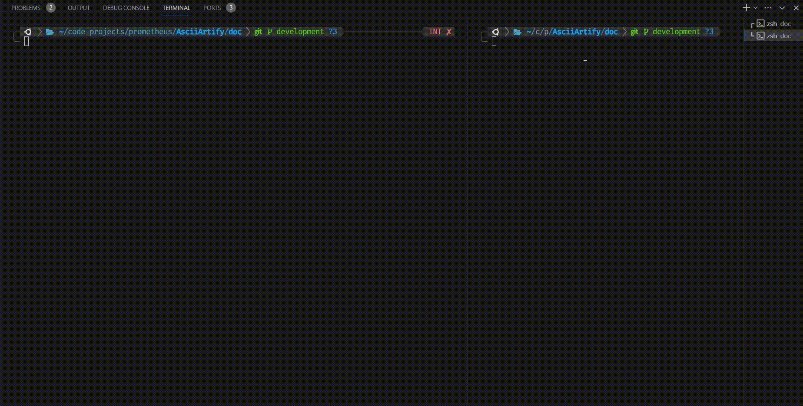

# MVP

## 1. Creating Apps Via UI

 1. Open a browser to the Argo CD external UI, and login by visiting the IP/hostname in a browser. After logging in, click the `+ New App button`
 2. Give your app the name `AsciiArtify`, use the project `default`, and leave the sync policy as `Manual`.
 3. Connect the <https://github.com/den-vasyliev/go-demo-app> repo to Argo CD by setting **repository url** to the github repo url, leave **revision** as `HEAD`, and set the **path** to helm.
 4. For **Destination**, set local cluster URL and namespace to `AsciiArtify`
 5. After filling out the information above, click `Create` at the top of the UI to create the `AsciiArtify` application


## 2. App Sync (Deploy)

1. In the program information window, click the `SYNC` button.
2. A window pops up on the right where you need to select the components and synchronization modes and click the `SYNCHRONIZE` button.
3. After the process is complete, we can check the correctness of the program deployment by checking its status in the cluster:


## 3. App Check

1. Forward ports with the following command:

```zsh
kubectl port-forward -n demo svc/ambassador 8081:80
```

2. In another terminal, make a request for the specified port and get a response in the form of the application version.
3. Upload a random picture and upload it to our app.


