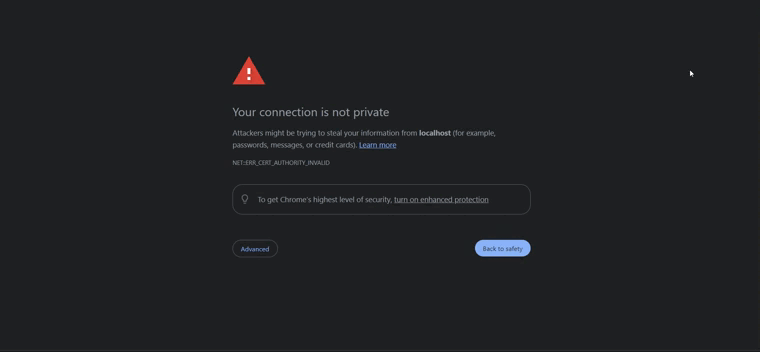

# POC

## 1. Install Argo CD

```bash
kubectl create namespace argocd
kubectl apply -n argocd -f https://raw.githubusercontent.com/argoproj/argo-cd/stable/manifests/install.yaml
```

This will create a new namespace, argocd, where Argo CD services and application resources will live.


## 2. Access The Argo CD API Server

### Port Forwarding

Kubectl port-forwarding can also be used to connect to the API server without exposing the service.

```bash
kubectl port-forward svc/argocd-server -n argocd 8080:443
```

Get argocd initial admin secret for GUI

```zsh
kubectl -n argocd get secrets argocd-initial-admin-secret -o jsonpath={.data.password} | base64 -d; echo
```


